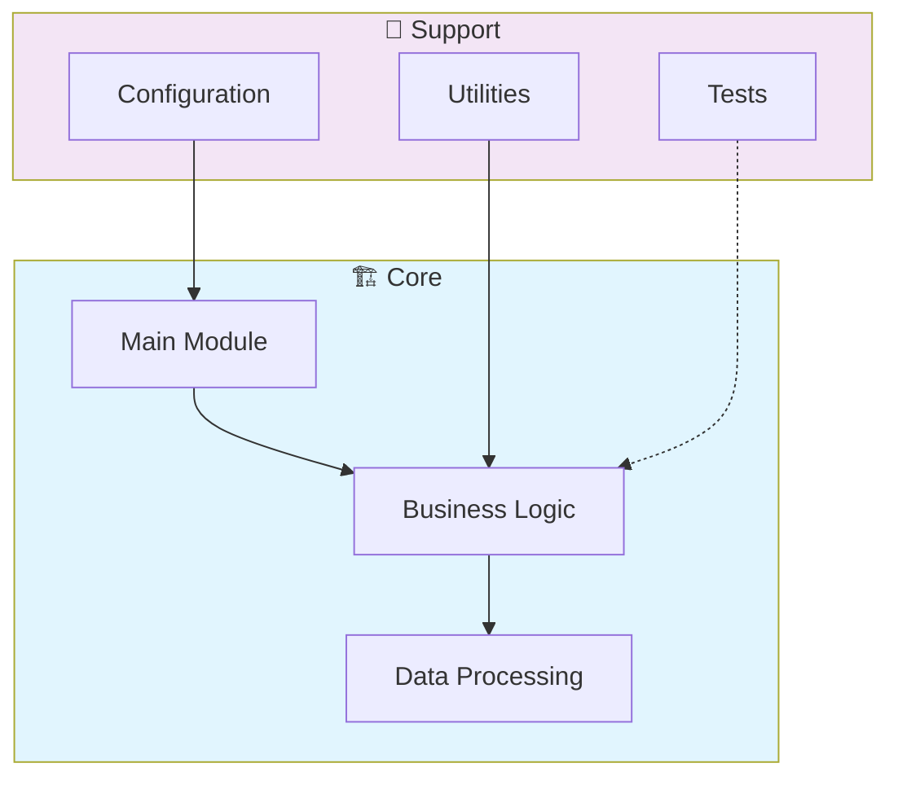

# 📊 Rust High Performance Data Processing

> High-performance data processing engine in Rust. Implements zero-copy parsing, SIMD operations, memory-mapped I/O, and parallel pipelines for throughput-critical data workloads.

[](https://img.shields.io/badge/)
[](https://img.shields.io/badge/)
[](LICENSE)

[English](#english) | [Português](#português)

---

## English

### 🎯 Overview

**Rust High Performance Data Processing** is a production-grade Rust application complemented by Shell that showcases modern software engineering practices including clean architecture, comprehensive testing, containerized deployment, and CI/CD readiness.

The codebase comprises **643 lines** of source code organized across **7 modules**, following industry best practices for maintainability, scalability, and code quality.

### ✨ Key Features

- **🔄 Data Pipeline**: Scalable ETL with parallel processing
- **✅ Data Validation**: Schema validation and quality checks
- **📊 Monitoring**: Pipeline health metrics and alerting
- **🔧 Configurability**: YAML/JSON-based pipeline configuration
- **🐳 Containerized**: Docker support for consistent deployment
- **🏗️ Object-Oriented**: 3 core classes with clean architecture

### 🏗️ Architecture




### 🚀 Quick Start

#### Prerequisites

- Rust 1.75+ (via [rustup](https://rustup.rs/))
- Cargo (included with Rust)

#### Installation

```bash
# Clone the repository
git clone https://github.com/galafis/rust-high-performance-data-processing.git
cd rust-high-performance-data-processing

# Build in release mode
cargo build --release
```

#### Running

```bash
# Run the application
cargo run --release

# Or run the binary directly
./target/release/rust_high_performance_data_processing
```

### 🧪 Testing

```bash
# Run all tests
cargo test

# Run with output
cargo test -- --nocapture

# Run specific test
cargo test test_name
```

### 📁 Project Structure

```
rust-high-performance-data-processing/
├── benches/
│   └── data_processing_benchmark.rs
├── data/
├── diagrams/
├── docs/          # Documentation
│   ├── ARCHITECTURE.md
│   ├── AUDIT_SUMMARY.md
│   └── PERFORMANCE_GUIDE.md
├── images/
├── scripts/
│   ├── build_and_test.sh
│   └── run_benchmarks.sh
├── src/          # Source code
│   ├── csv_processing/
│   │   └── mod.rs
│   ├── lib.rs
│   └── main.rs
├── tests/         # Test suite
│   └── integration_tests.rs
├── CONTRIBUTING.md
├── Cargo.toml
├── Dockerfile
├── LICENSE
└── README.md
```

### 📊 Performance Metrics

The engine calculates comprehensive performance metrics:

| Metric | Description | Formula |
|--------|-------------|---------|
| **Sharpe Ratio** | Risk-adjusted return | (Rp - Rf) / σp |
| **Sortino Ratio** | Downside risk-adjusted return | (Rp - Rf) / σd |
| **Max Drawdown** | Maximum peak-to-trough decline | max(1 - Pt/Pmax) |
| **Win Rate** | Percentage of profitable trades | Wins / Total |
| **Profit Factor** | Gross profit / Gross loss | ΣProfit / ΣLoss |
| **Calmar Ratio** | Return / Max Drawdown | CAGR / MDD |
| **VaR (95%)** | Value at Risk | 5th percentile of returns |
| **Expected Shortfall** | Conditional VaR | E[R | R < VaR] |

### 🛠️ Tech Stack

| Technology | Description | Role |
|------------|-------------|------|
| **Rust** | Core Language | Primary |
| **Docker** | Containerization platform | Framework |
| Shell | 2 files | Supporting |

### 🤝 Contributing

Contributions are welcome! Please feel free to submit a Pull Request. For major changes, please open an issue first to discuss what you would like to change.

1. Fork the project
2. Create your feature branch (`git checkout -b feature/AmazingFeature`)
3. Commit your changes (`git commit -m 'Add some AmazingFeature'`)
4. Push to the branch (`git push origin feature/AmazingFeature`)
5. Open a Pull Request

### 📄 License

This project is licensed under the MIT License - see the [LICENSE](LICENSE) file for details.

### 👤 Author

**Gabriel Demetrios Lafis**
- GitHub: [@galafis](https://github.com/galafis)
- LinkedIn: [Gabriel Demetrios Lafis](https://linkedin.com/in/gabriel-demetrios-lafis)

---

## Português

### 🎯 Visão Geral

**Rust High Performance Data Processing** é uma aplicação Rust de nível profissional, complementada por Shell que demonstra práticas modernas de engenharia de software, incluindo arquitetura limpa, testes abrangentes, implantação containerizada e prontidão para CI/CD.

A base de código compreende **643 linhas** de código-fonte organizadas em **7 módulos**, seguindo as melhores práticas do setor para manutenibilidade, escalabilidade e qualidade de código.

### ✨ Funcionalidades Principais

- **🔄 Data Pipeline**: Scalable ETL with parallel processing
- **✅ Data Validation**: Schema validation and quality checks
- **📊 Monitoring**: Pipeline health metrics and alerting
- **🔧 Configurability**: YAML/JSON-based pipeline configuration
- **🐳 Containerized**: Docker support for consistent deployment
- **🏗️ Object-Oriented**: 3 core classes with clean architecture

### 🏗️ Arquitetura


### 🚀 Início Rápido

#### Prerequisites

- Rust 1.75+ (via [rustup](https://rustup.rs/))
- Cargo (included with Rust)

#### Installation

```bash
# Clone the repository
git clone https://github.com/galafis/rust-high-performance-data-processing.git
cd rust-high-performance-data-processing

# Build in release mode
cargo build --release
```

#### Running

```bash
# Run the application
cargo run --release

# Or run the binary directly
./target/release/rust_high_performance_data_processing
```

### 🧪 Testing

```bash
# Run all tests
cargo test

# Run with output
cargo test -- --nocapture

# Run specific test
cargo test test_name
```

### 📁 Estrutura do Projeto

```
rust-high-performance-data-processing/
├── benches/
│   └── data_processing_benchmark.rs
├── data/
├── diagrams/
├── docs/          # Documentation
│   ├── ARCHITECTURE.md
│   ├── AUDIT_SUMMARY.md
│   └── PERFORMANCE_GUIDE.md
├── images/
├── scripts/
│   ├── build_and_test.sh
│   └── run_benchmarks.sh
├── src/          # Source code
│   ├── csv_processing/
│   │   └── mod.rs
│   ├── lib.rs
│   └── main.rs
├── tests/         # Test suite
│   └── integration_tests.rs
├── CONTRIBUTING.md
├── Cargo.toml
├── Dockerfile
├── LICENSE
└── README.md
```

### 📊 Performance Metrics

The engine calculates comprehensive performance metrics:

| Metric | Description | Formula |
|--------|-------------|---------|
| **Sharpe Ratio** | Risk-adjusted return | (Rp - Rf) / σp |
| **Sortino Ratio** | Downside risk-adjusted return | (Rp - Rf) / σd |
| **Max Drawdown** | Maximum peak-to-trough decline | max(1 - Pt/Pmax) |
| **Win Rate** | Percentage of profitable trades | Wins / Total |
| **Profit Factor** | Gross profit / Gross loss | ΣProfit / ΣLoss |
| **Calmar Ratio** | Return / Max Drawdown | CAGR / MDD |
| **VaR (95%)** | Value at Risk | 5th percentile of returns |
| **Expected Shortfall** | Conditional VaR | E[R | R < VaR] |

### 🛠️ Stack Tecnológica

| Tecnologia | Descrição | Papel |
|------------|-----------|-------|
| **Rust** | Core Language | Primary |
| **Docker** | Containerization platform | Framework |
| Shell | 2 files | Supporting |

### 🤝 Contribuindo

Contribuições são bem-vindas! Sinta-se à vontade para enviar um Pull Request.

### 📄 Licença

Este projeto está licenciado sob a Licença MIT - veja o arquivo [LICENSE](LICENSE) para detalhes.

### 👤 Autor

**Gabriel Demetrios Lafis**
- GitHub: [@galafis](https://github.com/galafis)
- LinkedIn: [Gabriel Demetrios Lafis](https://linkedin.com/in/gabriel-demetrios-lafis)
