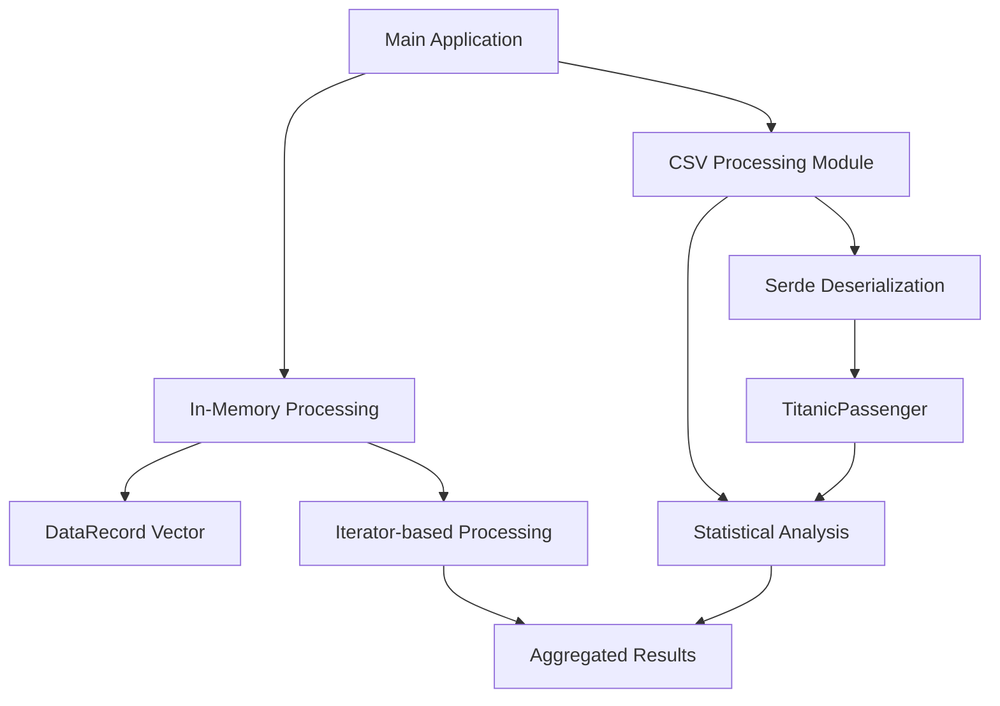

# High-Performance Data Processing with Rust


[](https://opensource.org/licenses/MIT)
[](https://github.com/galafis/rust-high-performance-data-processing/actions/workflows/rust.yml)


---

## 🇧🇷 Processamento de Dados de Alta Performance com Rust

Este repositório explora e demonstra **técnicas e implementações para processamento de dados de alta performance utilizando a linguagem Rust**. O foco é em como aproveitar a segurança de memória, o controle de baixo nível e a velocidade de execução de Rust para construir soluções eficientes para ingestão, transformação e análise de grandes volumes de dados. É ideal para **engenheiros de dados, desenvolvedores de sistemas e pesquisadores** que buscam otimizar pipelines de dados críticas e aplicações que exigem máxima performance.

### 🎯 Objetivo

O principal objetivo deste projeto é **fornecer exemplos práticos, benchmarks e tutoriais detalhados** sobre como utilizar Rust para tarefas de processamento de dados. Serão abordados tópicos como manipulação de dados em memória, serialização/desserialização eficiente, integração com bibliotecas como Apache Arrow e Polars, e estratégias para paralelização e concorrência.

### ✨ Destaques

- **Performance Extrema**: Demonstrações de como Rust oferece performance comparável a C/C++ para operações intensivas em dados.
- **Segurança de Memória**: Exemplos que ilustram como o sistema de *ownership* e *borrowing* de Rust previne erros comuns de memória em tempo de compilação.
- **Concorrência Eficiente**: Utilização de recursos nativos de Rust para construir pipelines de dados concorrentes e paralelas de forma segura e performática.
- **Integração com Ecossistema de Dados**: Como integrar Rust com ferramentas e formatos de dados populares como CSV, JSON e Parquet.
- **Código Profissional**: Exemplos de código bem estruturados, seguindo as melhores práticas da indústria, com foco em clareza, eficiência e documentação interna.
- **Documentação Completa**: Cada exemplo é acompanhado de documentação detalhada, benchmarks e casos de uso práticos para facilitar a compreensão e a aplicação.
- **Testes Abrangentes**: Módulos de código validados através de testes unitários, de integração e de documentação, garantindo a robustez e a confiabilidade das implementações.
- **Abordagem Didática**: Conteúdo apresentado de forma didática, ideal para aprendizado e referência, com explicações claras sobre os conceitos e a aplicação prática.
- **Processamento Avançado de CSV**: Um módulo completo (`csv_processing`) demonstrando o processamento eficiente de arquivos CSV, utilizando o dataset do Titanic como exemplo prático.

---

## 🇬🇧 High-Performance Data Processing with Rust

This repository explores and demonstrates **techniques and implementations for high-performance data processing using the Rust programming language**. The focus is on how to leverage Rust's memory safety, low-level control, and execution speed to build efficient solutions for ingesting, transforming, and analyzing large volumes of data. It is ideal for **data engineers, system developers, and researchers** looking to optimize critical data pipelines and applications that demand maximum performance.

### 🎯 Objective

The main objective of this project is to **provide practical examples, benchmarks, and detailed tutorials** on how to use Rust for data processing tasks. Topics covered include in-memory data manipulation, efficient serialization/deserialization, integration with libraries like Apache Arrow and Polars, and strategies for parallelization and concurrency.

### ✨ Highlights

- **Extreme Performance**: Demonstrations of how Rust offers performance comparable to C/C++ for data-intensive operations.
- **Memory Safety**: Examples illustrating how Rust's ownership and borrowing system prevents common memory errors at compile time.
- **Efficient Concurrency**: Utilization of native Rust features to build concurrent and parallel data pipelines safely and performantly.
- **Data Ecosystem Integration**: How to integrate Rust with popular data tools and formats like CSV, JSON, and Parquet.
- **Professional Code**: Well-structured code examples, following industry best practices, with a focus on clarity, efficiency, and internal documentation.
- **Complete Documentation**: Each example is accompanied by detailed documentation, benchmarks and practical use cases to facilitate understanding and application.
- **Comprehensive Testing**: Code modules validated through unit tests, integration tests, and documentation tests, ensuring the robustness and reliability of the implementations.
- **Didactic Approach**: Content presented didactically, ideal for learning and reference, with clear explanations of concepts and practical application.
- **Advanced CSV Processing**: A complete module (`csv_processing`) demonstrating efficient CSV file processing, using the Titanic dataset as a practical example.

### 📊 Visualization


*Comparative performance chart of Rust in data processing tasks relative to other languages.*

---

## 🏗️ Architecture



*High-level architecture diagram showing the data flow through the application.*

---

## 📁 Repository Structure

```
rust-high-performance-data-processing/
├── src/                    # Rust source code
│   ├── main.rs            # Main application entry point
│   ├── lib.rs             # Library public API
│   └── csv_processing/    # CSV processing module
│       └── mod.rs         # CSV module implementation
├── tests/                  # Integration tests
│   └── integration_tests.rs
├── benches/                # Performance benchmarks
│   └── data_processing_benchmark.rs
├── data/                   # Sample datasets
│   └── titanic.csv        # Titanic passenger dataset
├── images/                 # Images and graphics for documentation
│   ├── rust_high_performance_data_processing.png
│   └── rust_benchmark.png
├── diagrams/               # Mermaid diagrams
│   └── rust_data_processing.mmd
├── docs/                   # Additional documentation
│   ├── ARCHITECTURE.md    # Architecture and design documentation
│   └── PERFORMANCE_GUIDE.md  # Performance optimization guide
├── scripts/                # Utility scripts
│   ├── build_and_test.sh  # Build and test automation
│   └── run_benchmarks.sh  # Benchmark execution script
├── .github/                # GitHub configuration
│   └── workflows/         # CI/CD workflows
│       └── rust.yml       # Rust CI pipeline
├── Cargo.toml             # Project configuration and dependencies
├── Cargo.lock             # Locked dependency versions
├── LICENSE                # MIT license
└── README.md              # This file
```

---

## 🚀 Getting Started

### Prerequisites

- Rust 1.70 or higher (install from [rustup.rs](https://rustup.rs/))
- Git

### Installation

Clone the repository and navigate to the project directory:

```bash
git clone https://github.com/galafis/rust-high-performance-data-processing.git
cd rust-high-performance-data-processing
```

### Building the Project

Build the project in release mode for optimal performance:

```bash
cargo build --release
```

### Running the Application

Execute the main application:

```bash
cargo run --release
```

Expected output:
```
===========================================
Rust High-Performance Data Processing
===========================================
Processed 1000000 records
Average value: 749999.25
Time elapsed: ~27ms

Sample records:
  Record ID: 0, Value: 0.00
  Record ID: 1, Value: 1.50
  Record ID: 2, Value: 3.00
===========================================

Iniciando exemplo de processamento CSV avançado (Titanic)...

--- Análise de Dados do Titanic ---
Total de passageiros processados: 891
Passageiros que sobreviveram: 342
Taxa de sobrevivência: 38.38%
Passageiros masculinos: 577
Passageiros femininos: 314
------------------------------------
```

---

## 🧪 Testing

### Run All Tests

```bash
cargo test
```

This runs:
- **Unit tests** (8 tests in library modules)
- **Integration tests** (5 tests in `tests/` directory)
- **Documentation tests** (2 tests from code examples)

**Total: 13 passing tests** ✓

### Run Specific Test Suites

```bash
# Run only unit tests
cargo test --lib

# Run only integration tests
cargo test --test integration_tests

# Run only documentation tests
cargo test --doc
```

### Test Coverage

Run tests with verbose output:

```bash
cargo test -- --nocapture
```

---

## 📊 Benchmarks

Run performance benchmarks using Criterion:

```bash
cargo bench
```

Or use the provided script:

```bash
./scripts/run_benchmarks.sh
```

Benchmark results are saved to `target/criterion/` with detailed HTML reports.

### Benchmark Categories

1. **In-Memory Processing**: Tests data processing at different scales (100, 1K, 10K, 100K records)
2. **CSV Analysis**: Measures CSV parsing and analysis performance
3. **Data Generation**: Benchmarks record creation and vector allocation

---

## 📚 Documentation

### Generate Documentation

Generate and view the project documentation:

```bash
cargo doc --no-deps --open
```

### Additional Docs

- [Architecture Guide](docs/ARCHITECTURE.md) - System design and architecture
- [Performance Guide](docs/PERFORMANCE_GUIDE.md) - Optimization techniques and best practices

---

## 🔧 Development

### Code Quality

Check code formatting:

```bash
cargo fmt --check
```

Auto-format code:

```bash
cargo fmt
```

Run linter:

```bash
cargo clippy -- -D warnings
```

### Automated Build and Test

Use the comprehensive build script:

```bash
./scripts/build_and_test.sh
```

This script:
1. Cleans previous builds
2. Checks code formatting
3. Runs clippy
4. Builds in debug mode
5. Runs all tests
6. Builds in release mode
7. Executes the application

---

## 📈 Performance Characteristics

| Operation | Dataset Size | Average Time | Memory Usage |
|-----------|--------------|--------------|--------------|
| In-Memory Processing | 100K records | ~1-2 ms | ~2.4 MB |
| In-Memory Processing | 1M records | ~27 ms | ~24 MB |
| CSV Parsing (Titanic) | 891 records | ~1-2 ms | Minimal |

*Benchmarks run on a typical modern CPU in release mode.*

---

## 🤝 Contributing

Contributions are welcome! Please feel free to submit issues, pull requests, or suggest improvements.

### Guidelines

1. Fork the repository
2. Create a feature branch (`git checkout -b feature/amazing-feature`)
3. Make your changes
4. Run tests (`cargo test`)
5. Run formatting (`cargo fmt`)
6. Run clippy (`cargo clippy`)
7. Commit your changes (`git commit -m 'Add amazing feature'`)
8. Push to the branch (`git push origin feature/amazing-feature`)
9. Open a Pull Request

---

## 📝 License

This project is licensed under the MIT License - see the [LICENSE](LICENSE) file for details.

---

## 🙏 Acknowledgments

- The Rust community for excellent tools and libraries
- [csv-rs](https://github.com/BurntSushi/rust-csv) for efficient CSV parsing
- [Serde](https://serde.rs/) for powerful serialization
- [Criterion](https://github.com/bheisler/criterion.rs) for statistical benchmarking

---

**Author:** Gabriel Demetrios Lafis  
**Year:** 2025  
**Contact:** [GitHub](https://github.com/galafis)

---

## ⭐ Star History

If you find this project useful, please consider giving it a star! ⭐

---

**Happy Data Processing with Rust! 🦀**

