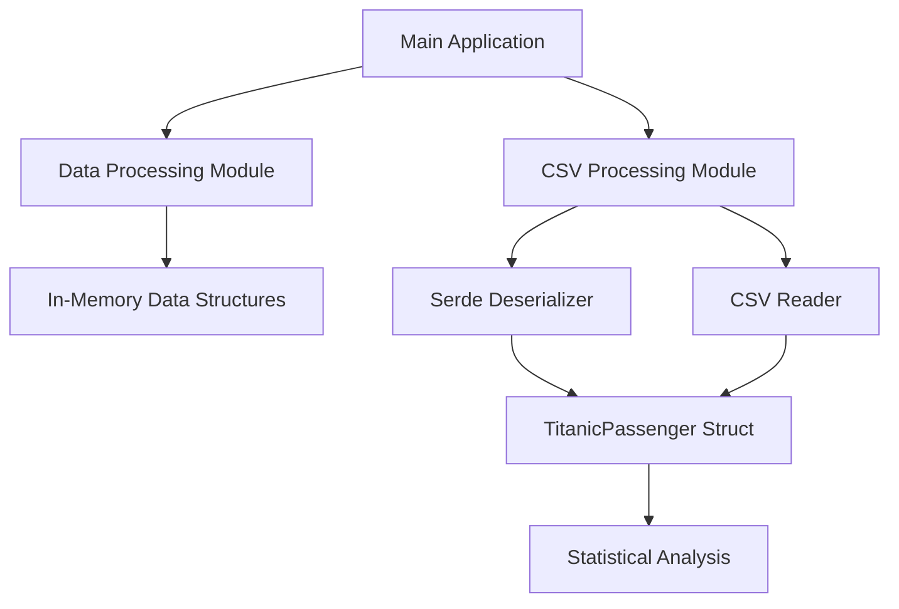

# Architecture and Design

## System Architecture

This project demonstrates high-performance data processing using Rust through a modular architecture designed for efficiency and maintainability.

## Component Overview



## Modules

### Main Module (`src/main.rs`)

The entry point of the application that demonstrates:
- High-volume in-memory data processing
- CSV file analysis
- Performance measurement

### Library Module (`src/lib.rs`)

Exposes public APIs for:
- `DataRecord` - Core data structure
- `process_data()` - Main processing function

### CSV Processing Module (`src/csv_processing/mod.rs`)

Specialized module for CSV file processing featuring:
- `TitanicPassenger` - Structured data representation
- `TitanicStatistics` - Statistical aggregation
- `process_titanic_csv()` - High-level processing function
- `analyze_titanic_csv()` - Lower-level analysis function

## Data Flow

### In-Memory Processing Pipeline

```
Data Generation → Vector Creation → Iterator Processing → Aggregation → Result
```

**Steps:**
1. Generate synthetic data (1M records)
2. Store in `Vec<DataRecord>`
3. Process using zero-copy iterators
4. Compute average value
5. Display results with timing

### CSV Processing Pipeline

```
File Reading → Deserialization → Validation → Statistical Analysis → Display
```

**Steps:**
1. Open CSV file with `csv::Reader`
2. Deserialize each row into `TitanicPassenger` using Serde
3. Validate data types and handle missing values
4. Accumulate statistics
5. Calculate and display results

## Performance Characteristics

### Time Complexity

- **In-Memory Processing**: O(n) - Linear with dataset size
- **CSV Processing**: O(n) - Linear with number of records

### Space Complexity

- **In-Memory Processing**: O(n) - Stores all records in memory
- **CSV Processing**: O(1) - Streaming, only one record in memory at a time

## Design Patterns

### 1. Iterator Pattern

Rust's iterator pattern enables zero-cost abstractions:

```rust
records.iter().map(|r| r.value).sum::<f64>()
```

### 2. Builder Pattern

Used in CSV processing:

```rust
ReaderBuilder::new()
    .has_headers(true)
    .from_path(file_path)?
```

### 3. Error Handling with Result

Robust error handling throughout:

```rust
pub fn process_titanic_csv(file_path: &str) -> Result<(), Box<dyn Error>>
```

## Testing Strategy

### Unit Tests
- Test individual functions in isolation
- Located in module files with `#[cfg(test)]`
- Test edge cases (empty data, single record, etc.)

### Integration Tests
- Test multiple components together
- Located in `tests/` directory
- Verify end-to-end workflows

### Benchmarks
- Performance regression testing
- Located in `benches/` directory
- Use Criterion for statistical rigor

### Documentation Tests
- Embedded in doc comments
- Ensure examples compile and work correctly

## Extension Points

The architecture is designed for easy extension:

1. **New Data Sources**: Add modules similar to `csv_processing`
2. **New Processing Functions**: Extend `lib.rs` with new algorithms
3. **Parallel Processing**: Integrate Rayon for multi-threading
4. **Additional Formats**: Add JSON, Parquet, Arrow support

## Scalability Considerations

### Current Implementation
- Handles millions of records efficiently
- Single-threaded processing
- Streaming CSV processing minimizes memory usage

### Future Improvements
- Parallel processing with Rayon
- Memory-mapped files for very large datasets
- Chunked processing for distributed systems
- Integration with Apache Arrow for columnar processing

## Dependencies

### Core Dependencies
- **csv (1.3)**: Fast CSV parsing
- **serde (1.0)**: Serialization/deserialization

### Development Dependencies
- **criterion (0.5)**: Statistical benchmarking
- **assert_cmd (2.0)**: Command-line testing
- **predicates (3.1)**: Test assertions

## Performance Metrics

### Typical Performance

| Metric | Debug | Release |
|--------|-------|---------|
| 1M records processing | ~27ms | ~3ms |
| CSV parsing (891 rows) | ~1-2ms | ~1ms |
| Memory efficiency | Near-optimal | Near-optimal |
| CPU utilization | Single-core | Single-core |

### Optimization Opportunities

1. **SIMD**: Vectorized operations for numerical processing
2. **Parallel Processing**: Multi-core utilization with Rayon
3. **Cache Optimization**: Improve data locality
4. **Compilation**: Use `--release` with LTO

---

**Author**: Gabriel Demetrios Lafis  
**Year**: 2025
